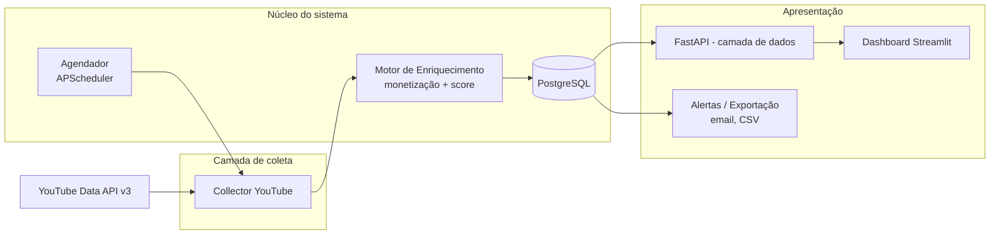

# 02 — Arquitetura Geral

## Stack recomendada

| Camada | Escolha | Motivo |
|---|---|---|
| Linguagem | Python 3.12+ | Escolha do time; melhor ecossistema para coleta de dados, agendamento e análise |
| Banco de dados | PostgreSQL | Robusto, lida bem com séries temporais (histórico de métricas), fácil de hospedar |
| ORM/migrations | SQLAlchemy + Alembic | Padrão de mercado em Python, migrations versionadas |
| Agendamento de coleta | APScheduler | Roda dentro do próprio processo Python, sem infra extra — suficiente para os jobs diários deste projeto |
| Backend/API interna | FastAPI | Serve os dados para o dashboard, valida dados do coletor, expõe endpoints se precisar integrar outra coisa depois |
| Dashboard | Streamlit | Python puro, sem precisar construir frontend separado; suficiente para tabelas, filtros e gráficos que o chefe precisa. Ver ressalva abaixo |
| Empacotamento/deploy | Docker + Docker Compose | Reproduzível, fácil de subir em qualquer VPS |

**Ressalva sobre o dashboard**: Streamlit é a opção mais rápida de construir e mantém tudo em Python. Ela cobre bem tabelas filtráveis, gráficos de evolução e drill-down por canal. Se no futuro for necessário multi-usuário com login granular ou customização visual pesada, aí sim vale migrar a camada de apresentação para FastAPI + React — a arquitetura abaixo já isola essa camada para que essa troca não exija reescrever o resto do sistema.

## Visão geral dos componentes



## Componentes em detalhe

### 1. Collector YouTube
Módulo único (`collectors/youtube.py`) responsável por toda a comunicação com a YouTube Data API v3, com três responsabilidades:

```python
class YouTubeCollector:
    def discover_candidates(self, niche_keywords: list[str]) -> list[ChannelRef]:
        """Encontra canais candidatos para um conjunto de palavras-chave de nicho."""

    def fetch_snapshot(self, channel_ref: ChannelRef) -> ChannelSnapshot:
        """Coleta as métricas atuais de um canal já conhecido (inscritos, views, etc.)."""

    def fetch_recent_content_signals(self, channel_ref: ChannelRef) -> list[ContentSignal]:
        """Coleta descrições/links recentes usados pelo motor de monetização."""
```

`ChannelRef`, `ChannelSnapshot` e `ContentSignal` são modelos de dados (Pydantic) — ver `03-modelo-de-dados.md`.

### 2. Agendador (Scheduler)
Roda dois tipos de job:
- **Job de descoberta** (menos frequente, ex.: 1x/dia): roda `discover_candidates` para cada nicho configurado, cadastra canais novos encontrados.
- **Job de snapshot** (mais frequente, ex.: 1x/dia por canal já cadastrado): roda `fetch_snapshot` para todo canal já conhecido, grava uma nova linha de histórico. É esse histórico que permite calcular taxa de crescimento.

Essa separação existe porque descoberta é muito mais cara em termos de cota da API do que reconsultar um canal já conhecido (ver `04-coleta-youtube.md`), então ela roda com menos frequência que a atualização de canais já mapeados.

### 3. Motor de Enriquecimento
Depois que um snapshot é gravado, roda:
- Cálculo de taxa de crescimento (comparando com snapshots anteriores).
- Detecção de sinais de monetização (regras sobre descrição, links, texto).
- Cálculo do score de nicho viral.

Detalhado em `05-motor-monetizacao-e-score.md`.

### 4. Banco de dados
PostgreSQL guarda: canais, histórico de snapshots (série temporal), sinais de monetização detectados, scores calculados, e metadados de execução dos jobs. Schema completo em `03-modelo-de-dados.md`.

### 5. Camada de apresentação
- FastAPI expõe endpoints internos de leitura (`/canais`, `/canais/{id}/historico`, `/nichos/ranking`) que o dashboard consome — separar isso evita acoplar a lógica de consulta ao código da tela, e deixa pronto para o dia em que outra coisa (um bot de Slack, uma planilha) precisar consumir os mesmos dados.
- Streamlit é o dashboard que o chefe usa (ver `06-dashboard.md`).
- Módulo de alertas/exportação roda periodicamente e manda e-mail quando um canal cruza um limiar de score, e permite exportar a visão atual para CSV.

## Estrutura de pastas sugerida

```
garimpo-de-canais/
  CLAUDE.md
  docs/                    # esta documentação
  src/
    collectors/
      youtube.py
      models.py            # ChannelRef, ChannelSnapshot, ContentSignal
    enrichment/
      monetization.py
      scoring.py
    db/
      models.py
      migrations/          # Alembic
    scheduler/
      jobs.py
    api/
      main.py               # FastAPI
    dashboard/
      app.py                # Streamlit
    config/
      niches.yaml           # lista de nichos/keywords configurável
      settings.py
  tests/
  docker-compose.yml
  Dockerfile
  .env.example
  pyproject.toml
```

## Decisões de arquitetura e por quê

- **Histórico como tabela de séries temporais, não só "estado atual"**: sem histórico não dá para calcular crescimento nem mostrar gráfico de evolução — é o dado mais valioso do sistema, não pode ser tratado como acessório.
- **Separar job de descoberta do job de snapshot**: evita estourar a cota gratuita da API do YouTube (ver `04-coleta-youtube.md`).
- **Streamlit em vez de um frontend separado**: prioriza velocidade de entrega e mantém tudo em Python; a camada `API`/FastAPI já isola essa decisão para poder ser revertida depois sem grande custo, se um dia precisar de algo mais robusto.
- **Um único collector, sem camada de abstração multi-plataforma**: como o escopo é só YouTube, evitar criar uma interface genérica "para o caso de um dia ter outra plataforma" — isso seria complexidade sem uso real hoje. Se um dia entrar outra fonte de dados, a refatoração é simples porque o motor de score e o dashboard já consultam o banco, não a API diretamente.
